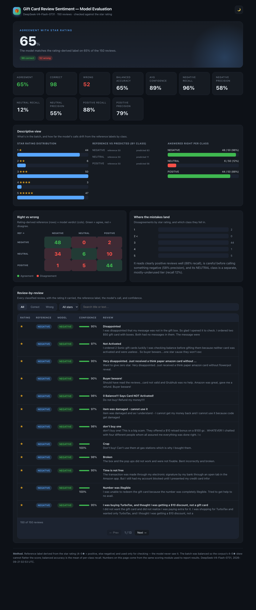

# Gift-Card Review Sentiment & Emotion Classifier — Final Report

A three-class review-sentiment and primary-emotion classifier for Amazon's **Gift Cards**
product reviews, built with an LLM labeler and compared against the star rating and a
word-list emotion baseline.



---
## Table of contents
- [Data source](#data-source)
- [Pipeline & method](#pipeline--method)
- [Deliverables](#deliverables)
- [Headline results](#headline-results)
- [Q1 — Why the lopsided run looked accurate](#q1--why-the-lopsided-run-looked-accurate)
- [Q2 — Where the mistakes go (confusion)](#q2--where-the-mistakes-go-confusion)
- [Q3 — LLM emotions vs the NRC word list](#q3--llm-emotions-vs-the-nrc-word-list)
- [Q4 — Bugs and issues encountered](#q4--bugs-and-issues-encountered)
- [Reproducing the run](#reproducing-the-run)

---

## Data source

The reviews come from the **Amazon Reviews '23** dataset by the **McAuley Laboratory** at
UC San Diego:

- Dataset home: <https://amazon-reviews-2023.github.io/>
- `<review_categories/Gift_Cards.jsonl.gz>` — 12.29 MB, **152,410** gift-card reviews
  (title, text, star rating, verified-purchase, helpful votes, timestamps, etc.)
- Hub/paper: Hou, He, et al., *"Bridging the User-Item Gap…The Amazon Reviews Dataset"*,
  arXiv:2403.03952, and the 🤗 dataset `McAuley-Lab/Amazon-Reviews-2023`.

The star rating is used **only** as the reference ("correct answer") for scoring; the model
is never shown it. Reference mapping for this report: **4–5★ → POSITIVE, 3★ → NEUTRAL, 1–2★ → NEGATIVE**.

## Pipeline & method

```
download (Gift_Cards.jsonl.gz)
  → sample (balanced ~50 per class, fixed seed 42)
  → classify (OpenAI-compatible endpoint, DeepSeek-V4-Flash-0731; text only)
  → evaluate (score vs rating-derived reference; per-class metrics, confusion)
  → dashboard (single-file HTML, HTML->PNG screenshot for this report)
```

The classifier runs through an **OpenAI-compatible endpoint** (instructor-provided,
`http://dobolyi.com:9000/v1`, model `DeepSeek-V4-Flash-0731`). Each review returns a
strict JSON verdict: `label ∈ {POSITIVE, NEUTRAL, NEGATIVE}`, `confidence ∈ [0,1]`,
`primary_emotion ∈ NRC-8`, and a one-line `reason`.

The **balanced sample** draws a roughly equal number of reviews per reference class
(50 / 50 / 50 = 150 total) using a fixed random seed, so the run is reproducible and rare
classes (especially 3★) are actually measured — the corpus itself is ~84% 4–5★.

## Deliverables

| File | Note |
|---|---|
| `giftcards/prompts.py` | the classifier prompt (+ parser / three-class labels) |
| `giftcards/evaluate.py` | scoring against the rating reference |
| `main.py` (`evaluate`) | the scoring script that runs the reviews |
| `giftcards/nrc.py` | word-list emotion scorer (NRC lexicon) |
| `giftcards/eval_dashboard.py` | dashboard generator |
| `results/balanced_run_150.csv` | one balanced run's raw output (150 rows) |
| `output/eval_dashboard.html` | the final dashboard (self-contained, offline) |
| `report/dashboard_full.png` | screenshot of the interface |

## Headline results

Run: **150 reviews**, 50/50/50 per class, fixed seed, text-only classification.

```
Overall accuracy  : 65.3%        Balanced accuracy (mean per-class recall): 65.3%
Correct / Wrong   : 98 / 52

             precision  recall    f1   support
NEGATIVE       0.58      0.96    0.72    50
NEUTRAL        0.55      0.12    0.20    50
POSITIVE       0.79      0.88    0.83    50

Confusion (reference rows × model columns)
              NEGATIVE  NEUTRAL  POSITIVE
NEGATIVE         48        0        2
NEUTRAL          34        6       10
POSITIVE          1        5       44
```

Supplementary figures (all shown in the dashboard): star distribution `1★:44, 2★:6, 3★:50,
4★:3, 5★:47`; reference vs predicted `NEG 50→83, NEU 50→11, POS 50→56`; answered-right
per class `48/50=96%, 6/50=12%, 44/50=88%`; average confidence 89%.

Refer to `results/balanced_run_150.csv` and the dashboard for the source of every number.

---

## Q1 — Why the lopsided run looked accurate

An earlier, **imbalanced, binary** pass (no NEUTRAL class, sampled in star order, so mostly
4–5★) reported **~92–93%** agreement. That flattering number came from two compounding
biases:

1. **Class imbalance.** The gift-card corpus is dominated by 5★ (and 1★) reviews. Sampled
   in order, the batch is an avalanche of the classes the model handles well, and the
   under-populated 3★ class barely appears — so the errors it would reveal are absent.
2. **No NEUTRAL option.** With only POSITIVE/NEGATIVE, the model was never asked to call a
   review neutral, and the "everything is positive or negative" framing could not expose
   the ★3 collapse.

Concretely: the imbalanced, binary run had essentially no ★3 reviews to score and forced a
2-way choice. **Balancing to 50 per class and adding NEUTRAL dropped measured accuracy from
~92% to 65.3%**, because the model now had to (and mostly failed to) separate the ★3 tier
it had previously been shielded from.

## Q2 — Where the mistakes go (confusion)

The confusion matrix above shows the error directions precisely. Reading reference rows →
predicted columns, the concrete numbers:

- **NEUTRAL (3★) does *not* get its own class — it collapses, mostly into NEGATIVE.** Of 50
  true 3★ reviews, only **6 (12%)** were called NEUTRAL; **34 were called NEGATIVE** and
  **10 POSITIVE**. So the dominant error is ★3 → NEGATIVE (34/50).
- **NEGATIVE is consequently over-predicted:** the model calls 83 reviews NEGATIVE when only
  50 are (high recall 96%, low precision 58%). It "solves" the neutral review by reading
  terse ★3 text ("As expected", "It's fine.") as a complaint.
- **POSITIVE is the cleanest class:** 44/50 (88% recall), with minor leakage (5 neutral, 1
  negative called positive).
- Few reviews are confused in the *other* direction: negative → positive is only 2/50.

Short version: the model is good on clearly positive and clearly negative reviews, and it
collapses neutral ★3 into negative rather than recognizing a distinct middle class. **Nothing
else is confused in reverse at meaningful volume.**

## Q3 — LLM emotions vs the NRC word list

Two independent primary-emotion signals were produced and kept:

1. **LLM** — the classifier prompt also returns a `primary_emotion` from the eight NRC
   emotions.
2. **NRC word list** — `giftcards/nrc.py` scores each review's tokens against the bundled
   NRC Emotion Lexicon v0.92 (Mohammad & Turney 2013), sums association counts per emotion,
   and takes the highest as the derived emotion. This needs **no model calls**.

On the current 150-review run (113 reviews where both signals were present), they agreed only
**12/113 ≈ 10.6%** of the time.

| Signal | Dominant emotions (count) |
|---|---|
| LLM | anger 50, joy 31, sadness 13, trust 11, fear 3, disgust 3, surprise 2 |
| NRC word list | **anticipation 69**, joy 16, anger 14, trust 8, sadness 5, fear 1 |

**Why they differ:**
- **Domain bias in the lexicon.** The NRC list maps many ordinary gift-card words (`buy,
  purchase, gift, receive, use, want, deal`) to *anticipation*, so the lexical baseline
  lands on "anticipation" for 69 of 113 reviews far more often than any human would. The
  LLM, reading whole sentences, almost never picks anticipation.
- **No context.** The word list counts literal word–emotion associations and misses
  negation, sarcasm, and tone ("this is a *great* scam" still scores trust/joy words). The
  LLM adjusts for intent.
- **Coverage.** 24 reviews had no NRC emotion match at all (no usable word-list verdict).

So the cheap word-list fallback is a *lexical* signal, not a *semantic* one, and in this
domain its anticipation inflation makes it a poor proxy for the LLM's (still imperfect)
emotion judgment.

## Q4 — Bugs and issues encountered

A few of the notable issues hit while building this, and the workarounds:

1. **Dashboard percentages didn't sum to 100.** Rounding each bar independently gave 101%/102%.
   Fixed with the largest-remainder integer distribution so per-class figures always total 100.
2. **Real-browser chart blanking (Step 7 UI bug).** The dashboard rendered perfectly in a Node
   simulation but opened **blank in a real browser**: the inline `<script type="application/json">`
   data blocks (holding the 150-row payload) were silently emptied by the HTML tokenizer when
   review text contained sequences like `<br />`, so `JSON.parse` failed. Verified *in the
   browser* (headless Chrome — the exact "check in the browser, not just by eye" situation),
   then fixed by embedding the data as a plain JS object (`window.__DATA__ = {…}`) instead of
   separate data `<script>` elements. Confirmed rendering + every on-page number in a real
   browser afterwards.
3. **Long background runs were lossy.** A 3,000-review classify job was killed mid-way and had
   written *nothing* (results only flushed at the end). Added incremental JSONL checkpointing so
   a partial run is never lost.
4. **Sampler bug with identical rows.** The balanced sampler originally excluded chosen rows by
   dictionary equality, so duplicate `{rating: 5.0}` rows collapsed and under-filled the batch.
   Switched to index-based exclusion.
5. **Model is non-deterministic.** Re-running the same batch gave 92% then 93% (temperature).
   Treat headline numbers as approximate and always keep the raw output it came from.
6. **Endpoint rejected `response_format`.** The vLLM endpoint couldn't take a JSON grammar;
   added a graceful fallback to prompt-only JSON.
7. **Local tooling blocked venv interpreters** (`python -m venv` could not run its own
   interpreter); switched the environment to `uv`.
8. **A tooling lesson, not a bug:** Node-executing the page's script was an incomplete
   substitute for a real browser — only a real HTML parser surfaced the data-block blanking
   above. That's why this report verifies numbers against the saved CSV *and* a rendered,
   read-back screenshot.

## Reproducing the run

```bash
uv venv && uv pip install -r requirements.txt
cp .env.example .env        # set OPENAI_BASE_URL / OPENAI_API_KEY / OPENAI_MODEL
uv run python main.py download
uv run python main.py sample --size 3000 --seed 42
uv run python main.py evaluate --size 150 --seed 42     # -> data/processed/eval_scored.jsonl
uv run python main.py emotions                          # -> data/processed/emotion_compare.jsonl
uv run python main.py eval-dashboard                    # -> output/eval_dashboard.html
uv run python -m pytest -m unit                         # 46 offline unit tests
```

`.env` holds credentials and is gitignored; each teammate uses their own endpoint.
